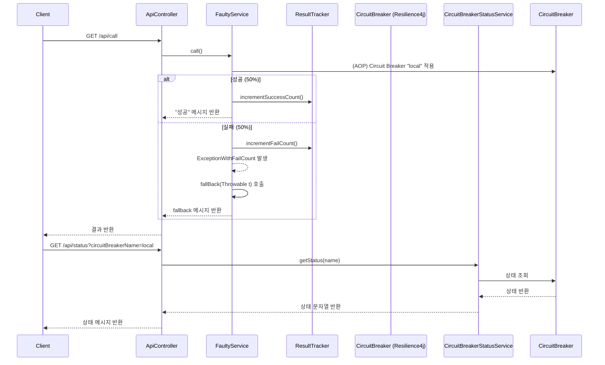

## 왜 사용하나요?

서버의 장애가 발생하는 경우는 항상 존재합니다.

1. 트래픽이 갑자기 몰리는 경우
2. 외부에 의존하고 있는 API에 문제가 발생하는 경우
3. 내부 로직이 병목을 발생시켜 자원이 부족한 경우 (Connection, Thread, Memory...)

이 외에도 예상할 수 있는/없는 다양한 에러가 발생가능 합니다.

`CircuitBreaker`는 에러가 발생한 후의 처리를 도우며 복구가 느린 외부 시스템이나 병목이 발생하기 쉬운 내부 컴포넌트와 통신할 때 효과적입니다.

- 외부 API 호출 실패 시 빠르게 대체 동작을 수행
- 내부 마이크로서비스 간 호출에서도, 하나의 장애가 전체 시스템 장애로 이어지지 않도록 보호

## 어떻게 동작하나요?

`CircuitBreaker`는 다음 세 가지 상태를 순환하며 작동합니다

1. CLOSED (정상 상태)

- 모든 요청을 통과시키며, 실패율을 모니터링합니다.

2. OPEN (차단 상태)

- 실패율이 임계치를 넘으면 열립니다. 일정 시간 동안 요청을 차단하고, 바로 fallback이 호출됩니다.

3. HALF-OPEN (시험 상태)

- 일정 시간 이후 일부 요청만 허용하여 서비스가 복구되었는지 확인합니다.
- 성공률이 높으면 다시 CLOSED 상태로 복귀합니다.

실패율, 상태 변경 등 기준이 되는 설정은 `application.yml`을 참고하시길 바랍니다.

## 어떻게 사용하나요?

특정 서비스에 장애가 발생한 경우, `Fallback` 메서드를 호출해 대처합니다.  
고객에게 지금은 사용이 불가능하다는 메시지 혹은 실패에 따른 보상 로직을 실행시킬 수 있습니다.

`CircuitBreaker`가 없는 경우 장애가 발생한 서비스를 지속적으로 호출하게 돼, `Connection`, `Thread` 자원의 낭비가 발생합니다.  
가령 `TimeOut`을 뱉는 서버로 계속해서 요청을 던지는 경우 큰 병목이 발생할 것 입니다.

## 특이점

`CircuitBreaker`는 실패를 막는 수단이 아닌, 실패 이후의 피해를 최소화하는 전략입니다.  
`CircuitBreaker`가 동작했다면, 이미 에러가 발생한 후의 상황이며 에러 발생을 방지하겠다면, `RateLimit` 사용을 고려할 수 있습니다. (Spike 되는 트래픽에 대해)

## 시나리오

1. API는 일정 확률로 실패합니다.
2. 설정 값이 제대로 적용되었는지 상태를 확인합니다.
3. OPEN, CLOSE, HALF-OPEN 상태에 따른 응답 값을 확인합니다.

<!-- This is an auto-generated comment: release notes by coderabbit.ai -->

## Summary by CodeRabbit

- **신규 기능**
  - 회로 차단기(Circuit Breaker) 예제 모듈이 추가되었습니다.
  - `/api/call` 엔드포인트에서 실패율이 50%인 서비스 호출 및 회로 차단기 동작을 체험할 수 있습니다.
  - `/api/status` 엔드포인트에서 회로 차단기 상태를 조회할 수 있습니다.
- **설정**
  - 회로 차단기 동작 조건(실패율 임계값, 슬라이딩 윈도우, 오픈/하프오픈 상태 전환 등)이 적용된 환경설정 파일이 추가되었습니다.
- **예외 처리**
  - 회로 차단기 이름이 유효하지 않거나 존재하지 않을 때 사용자 정의 예외가 반환됩니다.

<!-- end of auto-generated comment: release notes by coderabbit.ai -->

