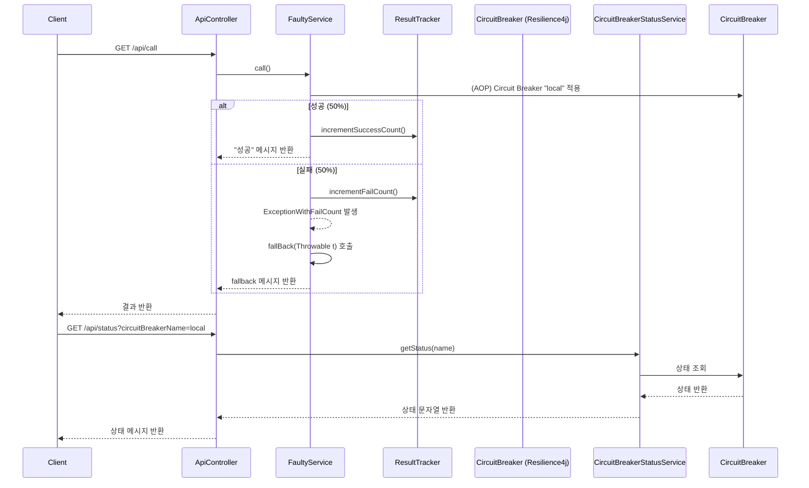

## 시나리오

1. api 는 특정 확률로 실패
2. 상태를 확인하며, 설정 값이 적용됐는지 확인
3. OPEN, CLOSE, HALF-OPEN 상태에따른 응답 값 확인

<!-- This is an auto-generated comment: release notes by coderabbit.ai -->

## Summary by CodeRabbit

- **신규 기능**
    - 회로 차단기(Circuit Breaker) 예제 모듈이 추가되었습니다.
    - `/api/call` 엔드포인트에서 실패율이 50%인 서비스 호출 및 회로 차단기 동작을 체험할 수 있습니다.
    - `/api/status` 엔드포인트에서 회로 차단기 상태를 조회할 수 있습니다.
- **설정**
    - 회로 차단기 동작 조건(실패율 임계값, 슬라이딩 윈도우, 오픈/하프오픈 상태 전환 등)이 적용된 환경설정 파일이 추가되었습니다.
- **예외 처리**
    - 회로 차단기 이름이 유효하지 않거나 존재하지 않을 때 사용자 정의 예외가 반환됩니다.

<!-- end of auto-generated comment: release notes by coderabbit.ai -->

